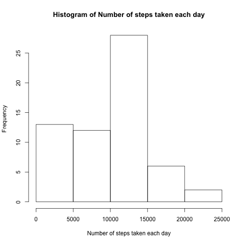
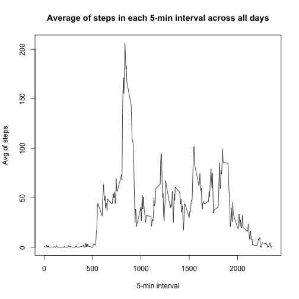
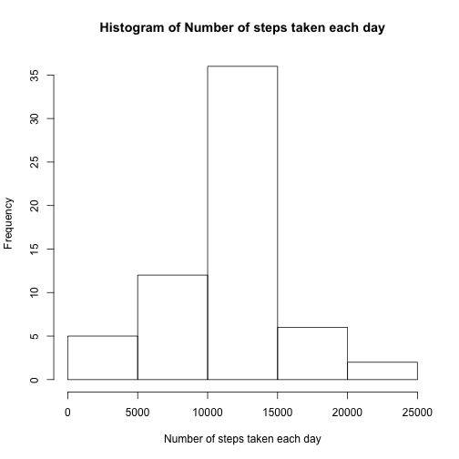
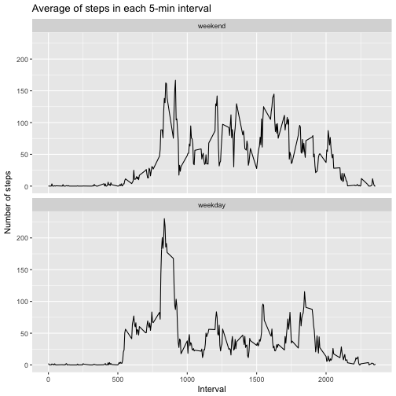

Course 5 Project 1 R Markdown File
========================

This report includes the code that I used to generate the output:

1.Load data and transform dataset's date from factor to date class


```r
data<-read.csv("activity.csv")
str(data)
```

```
## 'data.frame':	17568 obs. of  3 variables:
##  $ steps   : int  NA NA NA NA NA NA NA NA NA NA ...
##  $ date    : Factor w/ 61 levels "2012-10-01","2012-10-02",..: 1 1 1 1 1 1 1 1 1 1 ...
##  $ interval: int  0 5 10 15 20 25 30 35 40 45 ...
```

```r
data$date<-as.Date(as.character(data$date))
```

2.Histogram of the total number of steps taken each day


```r
stepsDayNARm<-with(data,tapply(steps,date,FUN=sum,na.rm=TRUE))
hist(stepsDayNARm,xlab="Number of steps taken each day",main="Histogram of Number of steps taken each day")
```



3.Mean and median number of steps taken each day


```r
meanStepsDayNARm<-mean(stepsDayNARm)
medianStepsDayNARm<-median(stepsDayNARm)
```

Mean of steps taken each day is 9354.2295082

Median of steps taken each day is 10395

4.Time series plot of the average number of steps taken


```r
meanStepsIntervalNARm<-with(data,tapply(steps,interval,FUN=mean,na.rm=TRUE))
meanStepsIntervalDFNARm<-data.frame(interval=names(meanStepsIntervalNARm),meanSteps=meanStepsIntervalNARm)
meanStepsIntervalDFNARm$interval<-as.numeric(as.character(meanStepsIntervalDFNARm$interval))
plot(meanStepsIntervalDFNARm$interval,meanStepsIntervalDFNARm$meanSteps,type='l',xlab="5-min interval",ylab="Avg of steps",main="Average of steps in each 5-min interval across all days")
```



5.The 5-minute interval that, on average, contains the maximum number of steps


```r
maxMeanStepsIntervalNARm<-meanStepsIntervalDFNARm[match(max(meanStepsIntervalNARm),meanStepsIntervalNARm),1]
```

The 5-minute interval that, on average, contains the maximum number of steps is 835

6.Code to describe and show a strategy for imputing missing data


```r
missingValuesCount<-sum(is.na(data$steps))   # calculate number of rows with missing step value
missingIndex<-which(is.na(data$steps))   # calculate index of row with missing step value
newdata<-data   # create a new dataset that is equal to the original dataset
for(i in 1:length(missingIndex)){   # replace missing value with mean for that 5-min interval across all days
    newdata[missingIndex[i],1]<-meanStepsIntervalDFNARm[meanStepsIntervalDFNARm$interval==newdata[missingIndex[i],3],2]
}
```

The total number of missing values in the dataset is 2304

The strategy for filling in all of the missing values in the dataset is to use the mean for that 5-minute interval across all days.

7.Histogram of the total number of steps taken each day after missing values are imputed


```r
stepsDayNARpl<-with(newdata,tapply(steps,date,FUN=sum))
hist(stepsDayNARpl,xlab="Number of steps taken each day",main="Histogram of Number of steps taken each day")
```



```r
meanStepsDayNARpl<-mean(stepsDayNARpl)
medianStepsDayNARpl<-median(stepsDayNARpl)
```
Mean of steps taken each day after missing values are imputed is 1.0766189 &times; 10<sup>4</sup>

Median of steps taken each day after missing values are imputed is 1.0766189 &times; 10<sup>4</sup>

8.Panel plot comparing the average number of steps taken per 5-minute interval across weekdays and weekends


```r
library(ggplot2)
newdata$wDay<-factor(grepl("S.+",weekdays(newdata$date)),levels=c(TRUE,FALSE),labels=c('weekend','weekday'))
ggplot(newdata,aes(y=steps,x=interval))+xlab("Interval")+ylab("Number of steps")+ggtitle("Average of steps in each 5-min interval")+stat_summary(fun.y=mean,geom="line")+facet_wrap(~wDay,nrow=2,ncol=1)
```


